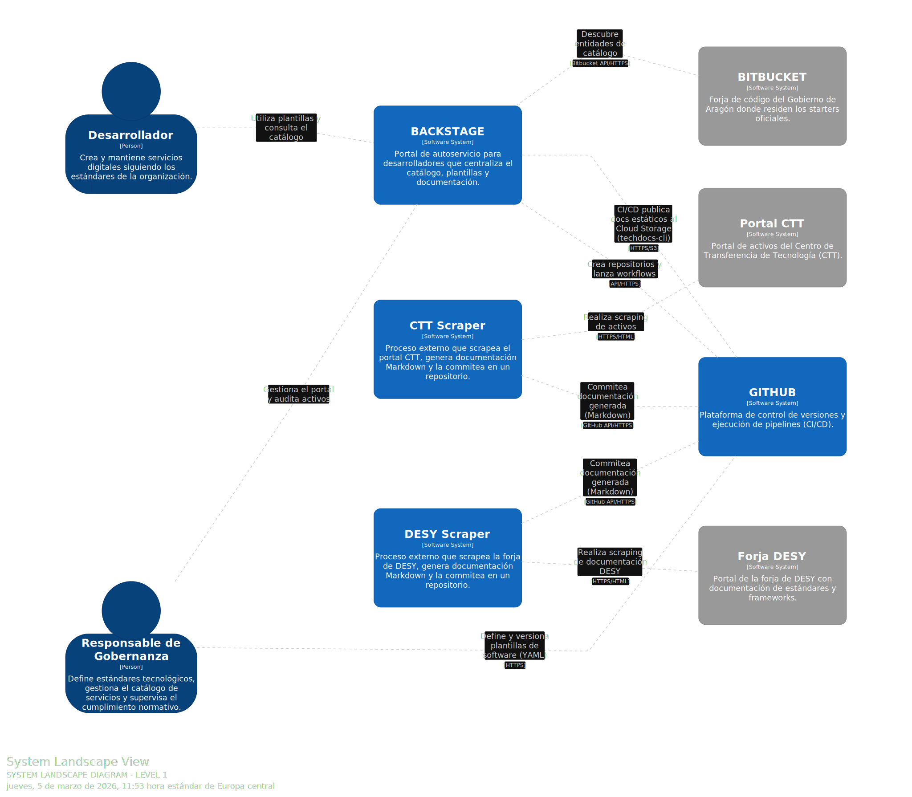
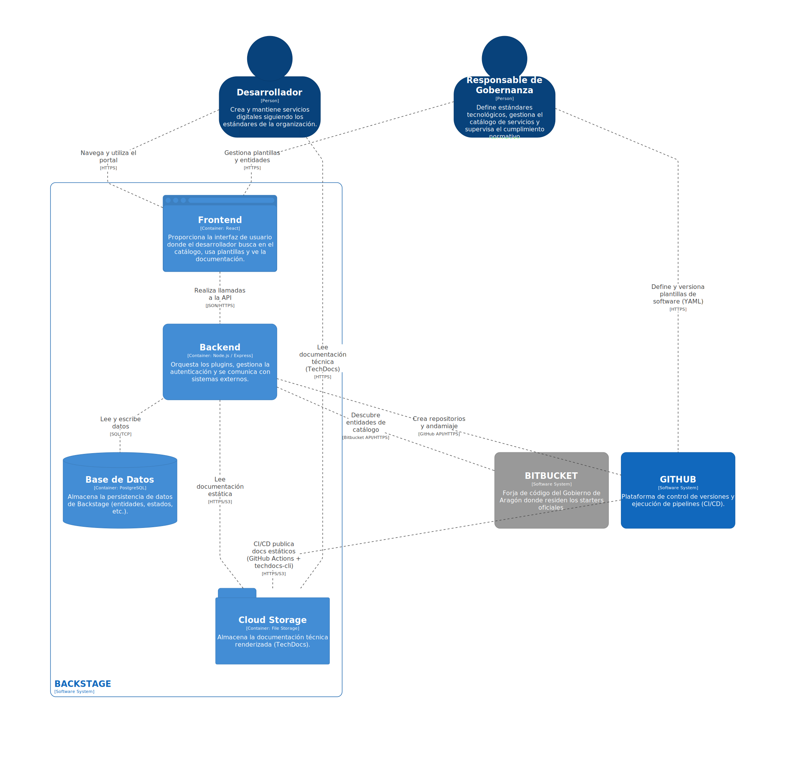
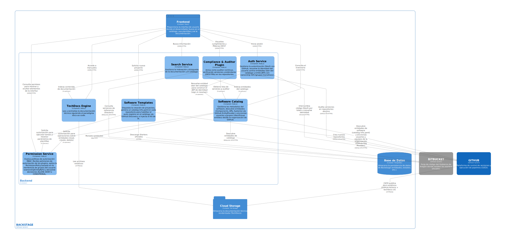

# IDP Aragón — Motor de Agilidad para el Desarrollo de Servicios Públicos

> **Trabajo Fin de Grado (TFG) — Ingeniería Informática**
> **Universidad de Zaragoza · 2025–2026**

[](https://github.com/guillermo-tfg/backstage-tfg)
[](https://backstage.io)
[](https://github.com/guillermo-tfg/backstage-tfg/actions/workflows/ci.yml)

## Descripción

Este proyecto implementa una **Plataforma Interna de Desarrollo (IDP)** basada en [Backstage.io](https://backstage.io), orientada a los equipos de ingeniería del **Gobierno de Aragón**. Actúa como ventanilla única de autoservicio que transforma procesos de homologación manuales en automatización inteligente.

El objetivo principal es reducir el *time-to-market* de nuevos servicios al ciudadano y garantizar el cumplimiento de estándares normativos (ENS, DESY) **por diseño**, sin fricción para los equipos de desarrollo.

> *"Antes pasaba el 40% de mi tiempo rellenando formularios de homologación. Con la plataforma, hago clic en una plantilla y tengo un entorno seguro y aprobado en 15 minutos."*

---

## Arquitectura

El proyecto modela la arquitectura usando el [modelo C4](https://c4model.com/) con [Structurizr DSL](docs/architecture/workspace.dsl). Las imágenes siguientes se regeneran automáticamente cuando el diagrama cambia.

### Nivel 1 — System Landscape



### Nivel 2 — Contenedores



### Nivel 3 — Componentes



---

## Ejes funcionales

### Golden Path DESY (implementado)

El primer *golden path* del IDP permite a cualquier desarrollador crear un proyecto frontend conforme al [Sistema de Diseño del Gobierno de Aragón (DESY)](https://desy.aragon.es) en pocos clics. El scaffolder de Backstage descarga el starter oficial desde el repositorio de `sdaragon` en Bitbucket y lo integra automáticamente con:

- Repositorio creado en la organización `portal-aragon` de GitHub
- Componente registrado en el catálogo de Backstage
- Notificación al usuario con los enlaces directos

Tipos de arquitectura disponibles: **HTML estático**, **Angular**, **React**, **Ionic (móvil)**.

### Catálogo de reutilización del CTT (planificado)

Integración del [Centro de Transferencia de Tecnología](https://administracionelectronica.gob.es/ctt/verPestanaGeneral.htm?idIniciativa=ctt) para registrar soluciones reutilizables de la Administración (`@firma`, `Cl@ve`, `Inside`…) como entidades del catálogo, con documentación técnica disponible vía TechDocs.

### Cumplimiento ENS (planificado)

Implementación del [Real Decreto 311/2022 (ENS)](https://www.boe.es/buscar/act.php?id=BOE-A-2022-7191) de forma transversal mediante:

| Medida ENS | Implementación |
|:---|:---|
| `[mp.sw.1]` Desarrollo de aplicaciones | Inyección automática de escaneos SAST/SCA en pipelines CI/CD |
| `[op.pl.2]` Arquitectura de seguridad | Componentes base con patrones de diseño seguros en las plantillas |
| `[op.exp.1]` Inventario de activos | Catálogo como fuente de verdad de servicios, APIs y recursos |
| `[org.4]` Identificación de responsables | Cada componente tiene `owner` asignado, garantizando trazabilidad |

### Kit de IA para DESY (planificado)

Inyección opcional de configuración MCP en los proyectos generados para que los asistentes de IA del desarrollador (Cursor, Copilot, Claude) dispongan de contexto completo sobre DESY y generen componentes de UI siguiendo los patrones oficiales.

---

## Estado de implementación

| Funcionalidad | Estado |
|:---|:---:|
| Backstage base (frontend + backend) | ✅ |
| Autenticación GitHub OAuth | ✅ |
| Catálogo con integración GitHub | ✅ |
| Golden Path DESY (Scaffolder) | 🚧 En pruebas |
| CI/CD automático en PRs | ✅ |
| Catálogo CTT Scraper | 📋 Planificado |
| Plugin cumplimiento ENS | 📋 Planificado |
| Plugin cumplimiento DESY (Pills) | 📋 Planificado |
| Kit de IA (MCP) | 📋 Planificado |

---

## Stack tecnológico

| Componente | Tecnología |
|:---|:---|
| Portal IDP | [Backstage.io](https://backstage.io) |
| Frontend | React + TypeScript |
| Backend | Node.js / Express (TypeScript) |
| Base de datos (prod) | PostgreSQL |
| Base de datos (dev) | SQLite in-memory |
| Autenticación | GitHub OAuth 2.0 |
| Control de versiones | GitHub (`portal-aragon`) |
| Starters DESY | Bitbucket (`sdaragon`) |
| Gestor de paquetes | Yarn 4 (Berry) |
| Arquitectura | C4 Model + Structurizr DSL |

---

## Desarrollo local

```bash
# Requisitos: Node.js 22, Yarn 4

# Instalar dependencias
yarn install

# Configurar credenciales locales (crear este archivo, no se commitea)
cp app-config.yaml app-config.local.yaml
# Rellenar AUTH_GITHUB_CLIENT_ID, AUTH_GITHUB_CLIENT_SECRET, GITHUB_TOKEN, etc.

# Arrancar frontend + backend
yarn start

# Probar el Golden Path DESY
# → http://localhost:3000/create → "Proyecto DESY"
```

### Comandos disponibles

```bash
yarn tsc          # Type checking
yarn lint         # Lint de ficheros modificados
yarn test         # Tests unitarios
yarn build:all    # Build de todos los paquetes

# Ver diagramas de arquitectura (Structurizr en http://localhost:8080)
docker compose up structurizr
```

### Variables de entorno

| Variable | Descripción |
|:---|:---|
| `GITHUB_TOKEN` | PAT de GitHub para la integración del catálogo |
| `AUTH_GITHUB_CLIENT_ID` | Client ID de la OAuth App de GitHub |
| `AUTH_GITHUB_CLIENT_SECRET` | Client Secret de la OAuth App de GitHub |
| `BITBUCKET_USERNAME` | Usuario de Bitbucket para acceder a los starters DESY |
| `BITBUCKET_APP_PASSWORD` | App Password de Bitbucket (scope: `read:repository`) |
| `POSTGRES_HOST/PORT/USER/PASSWORD` | Conexión a PostgreSQL (solo producción) |

---

## Público objetivo

| Rol | Beneficio |
|:---|:---|
| **Desarrollador** | Crea proyectos conformes a estándares sin conocimiento previo del ecosistema |
| **Responsable de Gobernanza** | Visibilidad centralizada de todos los servicios y su estado de cumplimiento |
| **Auditor de Seguridad** | Cada despliegue es seguro por defecto; el catálogo actúa como inventario ENS |

---

*TFG de Ingeniería Informática — Universidad de Zaragoza*
